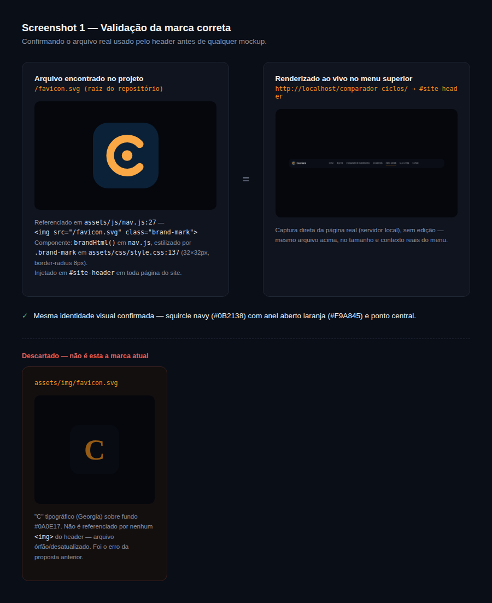
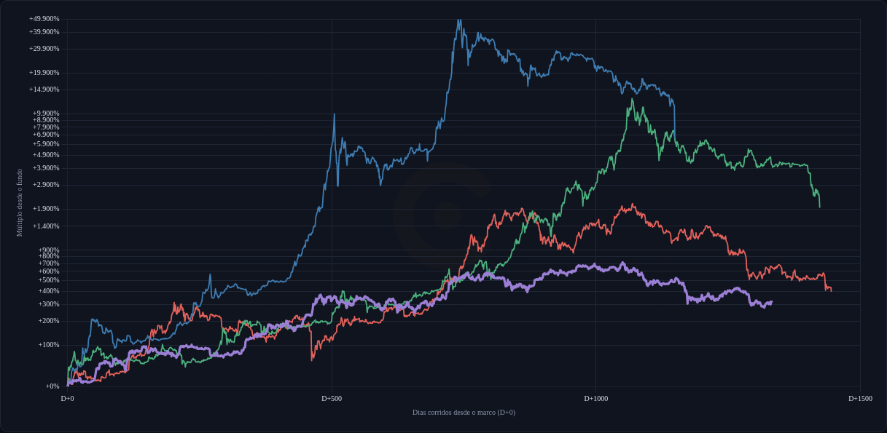
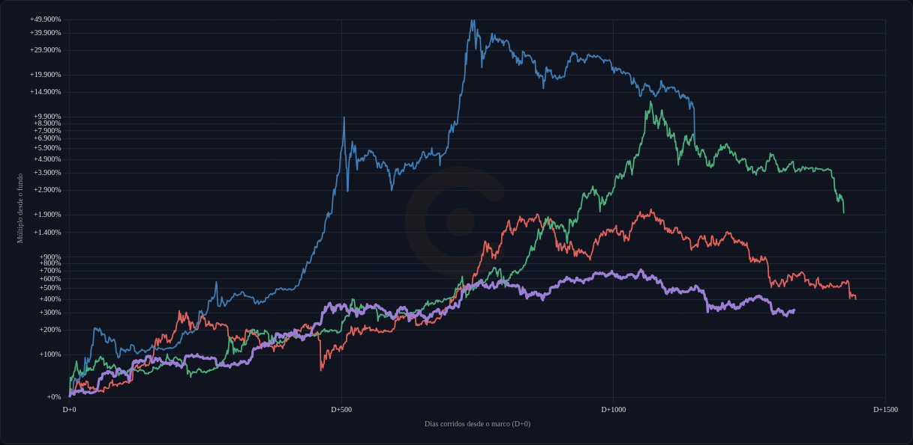
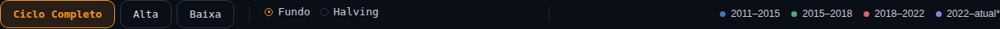

# Proposta visual — Comparador de Ciclos

> Mockup para validação visual, **sem implementação**. Nenhum arquivo de
> `comparador-ciclos/` foi alterado nesta PR.

## Correção de direção

A primeira rodada desta proposta usou `assets/img/favicon.svg` como
"logo Caio Garé" para a marca d'água — **arquivo errado**. Esse SVG é um
"C" tipográfico órfão: não é referenciado por nenhum `` do site,
é resto de uma identidade visual antiga.

## Passo 1 — logo correta

O header/navbar (`assets/js/nav.js`, função `brandHtml()`, linha 27)
usa:

```html

```

Ou seja, `/favicon.svg` **na raiz do repositório** — um arquivo
diferente de `assets/img/favicon.svg`, apesar do nome igual. É
estilizado por `.brand-mark` em `assets/css/style.css:137` (32×32px,
`border-radius:8px`) e injetado em `#site-header` por `brandHtml()` em
toda página do site (via `document.getElementById("site-header")`).

Essa é a marca real: squircle navy (`#0B2138`) com um anel aberto
laranja (`#F9A845`) e um ponto central — não um "C" de letra.

## Passo 2 — validação



Captura direta da página real (`comparador-ciclos/`, servidor local),
sem edição, ao lado do arquivo fonte — confirma que é a mesma marca. O
arquivo antigo (`assets/img/favicon.svg`) aparece riscado na parte de
baixo, para deixar claro por que foi descartado.

## Passo 3 — marca d'água: intensidade (2% vs. 4%)

Logo aprovada no Passo 1/2. Nesta rodada, só a intensidade — mesma
posição (centralizada, atrás das linhas), mesmo tamanho, único ponto de
comparação é a opacidade. Aplicada sobre o gráfico real (dados reais,
não uma réplica), capturando a ferramenta rodando localmente.

**Mockup A — opacidade 2%:**



**Mockup B — opacidade 4%:**



As duas capturas usam exatamente o mesmo elemento de marca, na mesma
posição — a única diferença entre os dois arquivos é `style.opacity`
(`0.02` vs `0.04`), aplicado via DOM na página carregada só para o
screenshot. Tamanho e posicionamento definitivos (e o componente
genérico reaproveitável em Comparador de Investimentos, Calculadora
DCA etc.) ficam para quando a intensidade for aprovada.

## Passo 4 — legenda: reposicionamento mínimo

A rodada anterior errou o alvo (virou 2ª linha / novo bloco). Correção:
**mesma barra, mesma linha, zero mudança de estrutura** — só aproximar
a legenda dos controles Fundo/Halving.

**Atual** — `.ciclos-toolbar` usa `justify-content:space-between`,
empurrando `.legenda-toolbar` para a ponta oposta da barra:



**Proposto** — troca só o `justify-content` da barra (de
`space-between` para o alinhamento natural ao início); a legenda passa
a ficar logo depois do divisor que já existe entre `.alinhamento-toggle`
e `.legenda-toolbar` no HTML atual. Mesmo markup, mesma linha, nenhum
elemento novo:


## Entrega desta PR

Rodada 1: Screenshot 1 (validação da logo), Screenshot 2 (toolbar
atual) e Screenshot 3 (toolbar com legenda reposicionada).
Rodada 2: Screenshot 1 (marca d'água 2%) e Screenshot 2 (marca d'água
4%), mesma posição, sobre o gráfico real. Nada além disso — sem PR,
sem alteração de código.
