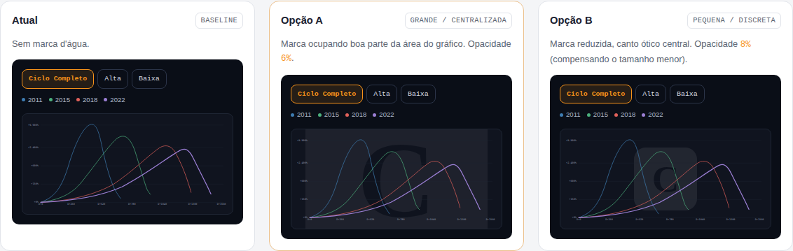
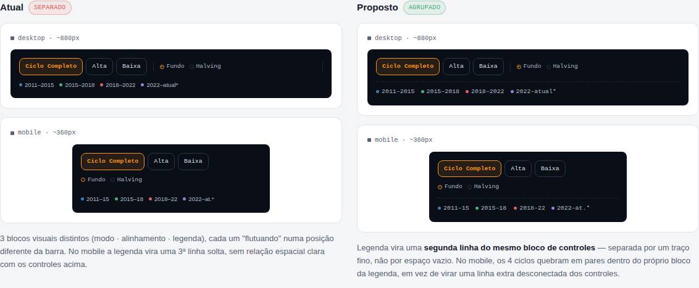

# Proposta visual — Comparador de Ciclos

> Mockup para validação visual, **sem implementação**. Nenhum arquivo de
> `comparador-ciclos/` foi alterado nesta PR. As réplicas abaixo usam as
> cores, fontes e componentes reais do site (`assets/css/style.css` e
> `comparador-ciclos/index.html`) só para simular o resultado final e
> permitir aprovação antes do desenvolvimento.

## 1. Marca d'água

Logo da Caio Garé (o mesmo ícone de `assets/img/favicon.svg`) centralizada
atrás das linhas do gráfico, em opacidade baixa — sem competir com a
leitura dos dados.

- **Opção A — grande / centralizada:** ocupa boa parte da área do
  gráfico, opacidade 6%.
- **Opção B — pequena / discreta:** marca reduzida no centro ótico,
  opacidade 8% (compensando o tamanho menor).

Nota de implementação: como o próprio `--bg-card` do gráfico é bem
escuro (`#10141F`), uma marca clara em 6–8% de opacidade já fica bem
mais visível do que "6–8%" sugere à primeira vista — os dois valores
acima foram calibrados visualmente dentro da faixa pedida (4–8%), não
escolhidos às cegas. Vale confirmar qual dos dois grupos prefere antes
de fixar o valor final.

## 2. Legenda

**Estado atual:** a legenda já divide a mesma barra dos controles
(`.ciclos-toolbar`), mas fica empurrada para a ponta oposta via
`justify-content:space-between` — funciona no desktop largo, mas no
mobile quebra para uma 3ª linha isolada, sem relação espacial clara com
os controles acima dela.

**Proposta:** agrupar a legenda como uma segunda linha do mesmo bloco de
controles, separada por um traço fino (não por espaço vazio). No
mobile, os 4 ciclos quebram em pares dentro do próprio bloco da
legenda, em vez de virar uma linha extra desconectada.

Objetivo: menos espaço desperdiçado, melhor leitura, melhor experiência
mobile, menor movimento ocular.

## Entrega desta PR

Apenas os mockups acima (renderizados também como página interativa
para inspeção lado a lado). Aguardando aprovação — a implementação real
(edição de `comparador-ciclos/index.html`, `assets/js/comparador-ciclos.js`
e a marca d'água) segue em PR separada, depois da escolha entre Opção A
e Opção B.
